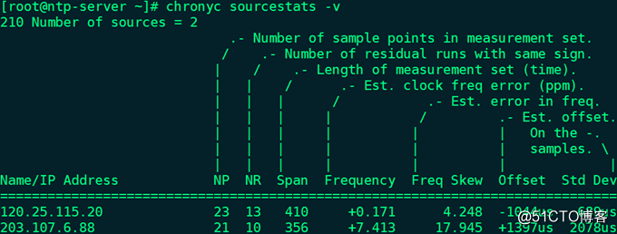
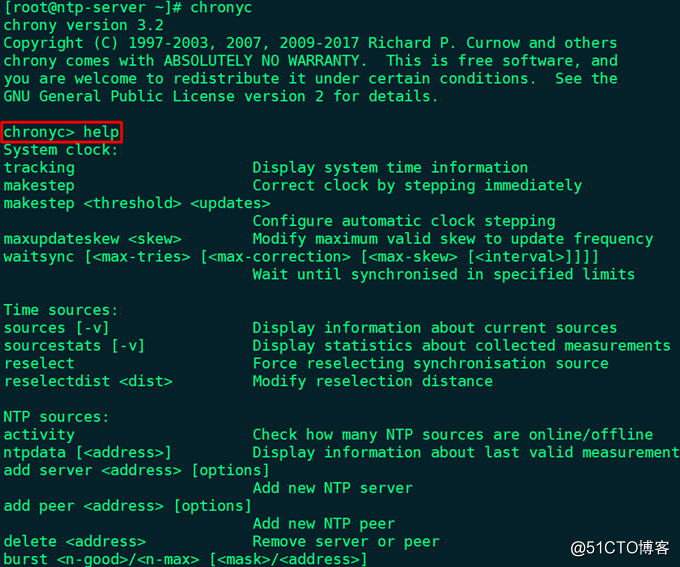
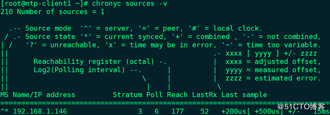
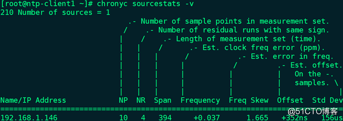
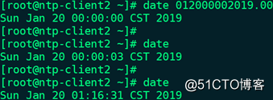
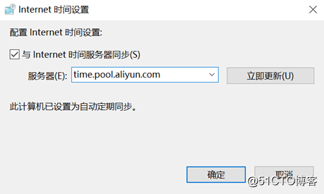
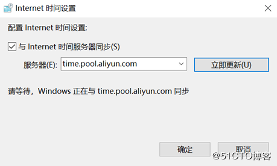
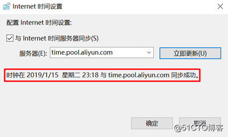

# CentOS 7.6安装配置Chrony同步系统时钟 #

## 一、简单介绍： ##

Chrony是NTP（Network Time Protocol，网络时间协议，服务器时间同步的一种协议）的另一种实现，与ntpd不同，它可以更快且更准确地同步系统时钟，最大程度的减少时间和频率误差。

Chrony包括两个核心组件：

- 1、chronyd：一个后台运行的守护进程，用于调整内核中运行的系统时钟与NTP服务器同步。它确定服务器增减时间的比率，并对此进行调整补偿；

- 2、chronyc：提供用户界面，用于监控性能并进行多样化的配置。它可以在chronyd实例控制的服务器上工作，也可以在一台不同的远程服务器上工作。

 

## 二、演示环境： ##

|IP|主机名|操作系统|服务器角色|描述|时间同步方式|
|192.168.1.146|ntp-server|CentOS   7.6|内网NTP Server|向阿里云提供的公网NTP服务器同步时间|作为内网NTP Server，内网中的其它服务器向其同步时间|chronyd服务平滑同步|
|192.168.1.147|ntp-client1|CentOS   7.6|内网NTP Client|向内网NTP Server 192.168.1.146同步时间|chronyd服务平滑同步|
|192.168.1.148|ntp-client2|CentOS   7.6|内网NTP Client|向内网NTP Server 192.168.1.146同步时间|crontab   + ntpdate强制同步|

 
**备注：使用chronyd服务平滑同步时间的方式要优于crontab + ntpdate，因为ntpdate同步时间会造成时间的跳跃，对一些依赖时间的程序和服务会造成影响，例如：sleep、timer等，且chronyd服务可以在修正时间的过程中同时修正CPU tick。**

 

## 三、192.168.1.146配置内网NTP Server： ##

1、关闭firewalld防火墙

2、关闭SELinux

3、配置主机名ntp-server：

    # echo "192.168.1.146 ntp-server" >> /etc/hosts
    # vim /etc/hostname --> ntp-server
    # hostnamectl set-hostname ntp-server
    # logout
    Ctrl + Shift + r
    # hostname

4、查看当前服务器时间：# date

image.png

5、安装并配置chrony：

    # yum -y install chrony
    # mv /etc/chrony.conf /etc/chrony.conf.bak
    # vim /etc/chrony.conf

新增如下代码：

    # 指定上层NTP服务器为阿里云提供的公网NTP服务器
    server ntp1.aliyun.com iburst minpoll 4 maxpoll 10
    server ntp2.aliyun.com iburst minpoll 4 maxpoll 10
    server ntp3.aliyun.com iburst minpoll 4 maxpoll 10
    server ntp4.aliyun.com iburst minpoll 4 maxpoll 10
    server ntp5.aliyun.com iburst minpoll 4 maxpoll 10
    server ntp6.aliyun.com iburst minpoll 4 maxpoll 10
    server ntp7.aliyun.com iburst minpoll 4 maxpoll 10
    
    # 记录系统时钟获得/丢失时间的速率至drift文件中
    driftfile /var/lib/chrony/drift
    
    # 如果系统时钟的偏移量大于10秒，则允许在前三次更新中步进调整系统时钟
    makestep 10 3
    
    # 启用RTC（实时时钟）的内核同步
    rtcsync
    
    # 只允许192.168.1网段的客户端进行时间同步
    allow 192.168.1.0/24
    
    # 阿里云提供的公网NTP服务器不可用时，采用本地时间作为同步标准
    local stratum 10
    
    # 指定包含NTP验证密钥的文件
    keyfile /etc/chrony.keys
    
    # 指定存放日志文件的目录
    logdir /var/log/chrony
    
    # 让chronyd在选择源时忽略源的层级
    stratumweight 0.05
    
    # 禁用客户端访问的日志记录
    noclientlog
    
    # 如果时钟调整大于0.5秒，则向系统日志发送消息
    logchange 0.5

备注：详细指令参数可以使用命令# man chrony.conf查看

6、启动chronyd服务：

    # systemctl start chronyd.service
    # systemctl status chronyd.service


显示如下：

```
● chronyd.service - NTP client/server
   Loaded: loaded (/usr/lib/systemd/system/chronyd.service; enabled; vendor preset: enabled)
   Active: active (running) since Thu 2021-08-05 14:13:10 CST; 3min 35s ago
     Docs: man:chronyd(8)
           man:chrony.conf(5)
  Process: 28856 ExecStartPost=/usr/libexec/chrony-helper update-daemon (code=exited, status=0/SUCCESS)
  Process: 28852 ExecStart=/usr/sbin/chronyd $OPTIONS (code=exited, status=0/SUCCESS)
 Main PID: 28854 (chronyd)
    Tasks: 1
   CGroup: /system.slice/chronyd.service
           └─28854 /usr/sbin/chronyd

Aug 05 14:13:10 beijing101 systemd[1]: Starting NTP client/server...
Aug 05 14:13:10 beijing101 chronyd[28854]: chronyd version 3.4 starting (+CMDMON +NTP +REFCLOCK +RTC +PRIVDROP +SCFILTER +SIGND +ASYNCDNS +SECHASH +IPV6 +DEBUG)
Aug 05 14:13:10 beijing101 chronyd[28854]: Frequency -22.123 +/- 3.346 ppm read from /var/lib/chrony/drift
Aug 05 14:13:10 beijing101 systemd[1]: Started NTP client/server.
Aug 05 14:13:15 beijing101 chronyd[28854]: Selected source 203.107.6.88
Aug 05 14:13:33 beijing101 chronyd[28854]: Selected source 120.25.115.20
```

    # ss -tunlp | grep chronyd


显示如下：

```
udp    UNCONN     0      0         *:123                   *:*                   users:(("chronyd",pid=28854,fd=7))
udp    UNCONN     0      0      127.0.0.1:323                   *:*                   users:(("chronyd",pid=28854,fd=5))
udp    UNCONN     0      0       ::1:323                  :::*                   users:(("chronyd",pid=28854,fd=6))
```

    # systemctl enable chronyd.service

7、查看时间同步源：

    # chronyc sources -v


显示如下：

```
210 Number of sources = 2

  .-- Source mode  '^' = server, '=' = peer, '#' = local clock.
 / .- Source state '*' = current synced, '+' = combined , '-' = not combined,
| /   '?' = unreachable, 'x' = time may be in error, '~' = time too variable.
||                                                 .- xxxx [ yyyy ] +/- zzzz
||      Reachability register (octal) -.           |  xxxx = adjusted offset,
||      Log2(Polling interval) --.      |          |  yyyy = measured offset,
||                                \     |          |  zzzz = estimated error.
||                                 |    |           \
MS Name/IP address         Stratum Poll Reach LastRx Last sample               
===============================================================================
^* 120.25.115.20                 2   5   177    36  +1675us[+1568us] +/-   20ms
^+ 203.107.6.88                  2   5   377    19  -1178us[-1178us] +/-   29ms
```

备注：120.25.115.20为ntp1.aliyun.com域名解析后的地址，203.107.6.88为ntp2.aliyun.com~ntp7.aliyun.com域名解析后的地址

8、查看时间同步源状态：

	# chronyc sourcestats -v



显示如下：

```
210 Number of sources = 2
                             .- Number of sample points in measurement set.
                            /    .- Number of residual runs with same sign.
                           |    /    .- Length of measurement set (time).
                           |   |    /      .- Est. clock freq error (ppm).
                           |   |   |      /           .- Est. error in freq.
                           |   |   |     |           /         .- Est. offset.
                           |   |   |     |          |          |   On the -.
                           |   |   |     |          |          |   samples. \
                           |   |   |     |          |          |             |
Name/IP Address            NP  NR  Span  Frequency  Freq Skew  Offset  Std Dev
==============================================================================
120.25.115.20              22  11   428     -0.214      5.668   +786us   875us
203.107.6.88               24  12   412     -0.130      5.508  -1234us   878us
```

备注：可直接输入命令chronyc进入交互式模式



常用指令说明：

- help：查看完整的命令帮助列表
- tracking：显示系统时间信息
- activity：检查多少NTP源在线/离线
- add server：手动添加一台新的NTP服务器
- delete：手动移除NTP服务器或对等服务器
- accheck：检查NTP访问是否对特定主机可用
- clients：在客户端报告已访问到的服务器

**说明：chronyd和chronyc的详细使用方法可以使用命令# man chronyd和# man chronyc查看**

 

## 四、192.168.1.147配置内网NTP Client： ##

1、关闭firewalld防火墙

2、关闭SELinux

3、配置主机名ntp-client1：

    # echo "192.168.1.147 ntp-client1" >> /etc/hosts
    # vim /etc/hostname --> ntp-client1
    # hostnamectl set-hostname ntp-client1
    # logout
    Ctrl + Shift + r
    # hostname

4、查看当前服务器时间：

    # date

image.png

5、安装并配置chrony：

    # yum -y install chrony
    # mv /etc/chrony.conf /etc/chrony.conf.bak
    # vim /etc/chrony.conf

新增如下代码：

    server 192.168.1.146 iburst
    driftfile /var/lib/chrony/drift
    makestep 10 3
    rtcsync
    local stratum 10
    keyfile /etc/chrony.keys
    logdir /var/log/chrony
    stratumweight 0.05
    noclientlog
    logchange 0.5

6、启动chronyd服务：

    # systemctl start chronyd.service
    # systemctl status chronyd.service


    # ss -tunlp | grep chronyd


    # systemctl enable chronyd.service

7、查看时间同步源：

    # chronyc sources -v



8、查看时间同步源状态：

    # chronyc sourcestats -v




## 五、192.168.1.148配置内网NTP Client： ##

1、关闭firewalld防火墙

2、关闭SELinux

3、配置主机名ntp-client2：

    # echo "192.168.1.148 ntp-client2" >> /etc/hosts
    # vim /etc/hostname --> ntp-client2
    # hostnamectl set-hostname ntp-client2
    # logout
    Ctrl + Shift + r
    # hostname

4、查看当前服务器时间：

    # date


5、安装ntpdate：

    # yum -y install ntpdate

6、编写定时任务，实现每3分钟向192.168.1.146同步一次时间，并将系统时间设置为硬件时间

    # crontab -e --> */3 * * * * /usr/sbin/ntpdate 192.168.1.146 &> /dev/null;/usr/sbin/hwclock -w
    # crontab -l
    # systemctl enable crond.service

7、测试定时任务：将时间调慢，观察服务器时间是否会自动同步



8、检查3台服务器的时间是否一致：


六、Windows 10自动定期同步阿里云Windows公共NTP服务器：

Win + r --> control panel --> 查看方式选择“类别”--> 时钟和区域 --> 日期和时间 --> Internet时间 --> 更改设置 --> 输入阿里云Windows公共NTP服务器地址time.pool.aliyun.com --> 立即更新





