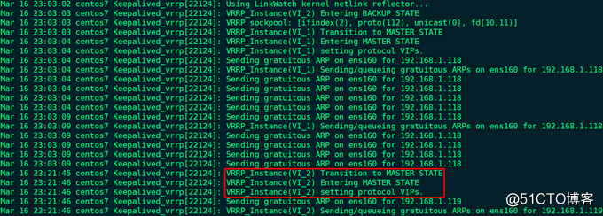

# CentOS 7.6安装配置Keepalived详解（一）：VIP地址漂移、邮件通知和双主模式实现 #

## 一、集群分类： ##

- HA Cluster：High Availability Cluster，高可用集群。运行于两个或多个节点上，当应用程序出现故障，或系统硬件、网络出现故障时，应用程序可以自动、快速地从一个节点切换到另一个节点，最大限度地减少服务中断时间，从而保证应用程序持续、不间断地对外提供服务。对于此类集群还有很多通俗的名称，如“双机热备”、“双机互备”等。
- LB Cluster：Load Balance Cluster，负载均衡集群。运行于两个或多个节点上，客户端的请求按照不同的算法分配给后端服务器，以减轻服务器的压力，降低对服务器的硬件和软件要求，适用于大负载访问量的服务，如Web服务。负载均衡集群可以通过软件方式实现，也可以通过硬件设备来实现。
- HPC Cluster：High Performance Computing Cluster，高性能计算集群。提供单个计算机所不能提供的强大计算能力，包括数值计算和数据处理，并且倾向于追求综合性能。


## 二、Keepalived简介： ##

Keepalived是VRRP协议的软件实现，原生设计是为了高可用IPVS服务，可以实现如下功能：

- 基于VRRP协议完成地址流动
- 为VIP地址所在的IPVS集群节点生成IPVS规则（在配置文件中预先定义）
- 为IPVS集群的各RS做健康状态检测
- 基于脚本调用接口，通过执行脚本完成脚本中定义的功能，进而影响集群事务

 

VRRP：Virtual Router Redundancy Protocol，虚拟路由冗余协议。VRRP是一种路由容错协议，也可称为备份路由协议。一个局域网内的所有主机都设置缺省路由，当网内主机发出的目的地址不在本网段时，报文将被通过缺省路由发往外部路由器，从而实现了主机与外部网络的通信。当缺省路由器down掉（即端口关闭）之后，内部主机将无法与外部通信，如果路由器设置了VRRP，虚拟路由将启用备份路由器，从而实现全网通信。

 

Keepalived架构图如下所示：


## 三、VRRP相关术语介绍： ##

- 虚拟路由器：由一个Master路由器和多个Backup路由器组成。主机将虚拟路由器当作默认网关。
- VRID：虚拟路由器标识，有相同VRID的一组路由器构成一个虚拟路由器。
- Master路由器：虚拟路由器中承担报文转发任务的路由器。
- Backup路由器：Master路由器出现故障时，能够代替Master路由器工作的路由器。
- 虚拟IP地址：虚拟路由器的IP地址。一个虚拟路由器可以拥有一个或多个IP地址。
- 虚拟MAC地址：一个虚拟路由器拥有一个虚拟MAC地址。虚拟MAC地址的格式为00-00-5E-00-01-{VRID}。通常情况下，虚拟路由器回应ARP请求使用的是虚拟MAC地址。只有虚拟路由器做特殊配置时，才回应接口的真实MAC地址。
- 优先级：VRRP根据优先级来确定虚拟路由器中每台路由器的地位，范围为0~255。
- 非抢占方式：如果Backup路由器工作在非抢占方式下，则只要Master路由器没有出现故障，Backup路由器即使随后被配置了更高的优先级也不会成为Master路由器。
- 抢占方式：如果Backup路由器工作在抢占方式下，当它收到VRRP报文后，会将自己的优先级与通告报文中的优先级进行比较，如果自己的优先级比当前的Master路由器的优先级高，就会主动抢占成为Master路由器；否则，将保持Backup状态。


## 四、VRRP工作过程： ##

1、虚拟路由器中的路由器根据优先级选举出Master。Master路由器通过发送免费ARP报文，将自己的虚拟MAC地址通知给与它连接的设备或者主机，从而承担报文转发任务；

2、Master路由器周期性发送VRRP报文，以公布其配置信息（优先级等）和工作状态；

3、如果Master路由器出现故障，虚拟路由器中的Backup路由器将根据优先级重新选举出新的Master；

4、虚拟路由器状态切换时，Master路由器由一台设备切换为另一台设备，新的Master路由器只是简单地发送一个携带虚拟路由器的MAC地址和虚拟IP地址信息的免费ARP报文，这样就可以更新与它连接的主机或设备中的ARP相关信息。网络中的主机感知不到Master路由器已经切换为另一台设备。

5、Backup路由器的优先级高于Master路由器时，由Backup路由器的工作方式（抢占方式和非抢占方式）决定是否重新选举Master。


## 五、Keepalived实现VIP地址漂移： ##

1、演示环境：

|IP|操作系统|主机名|部署服务|

|192.168.1.143|CentOS   7.6 x86_64|node1|keepalived|

|192.168.1.144|CentOS   7.6 x86_64|node2|keepalived|

 
2、各节点通过chrony服务同步时间

3、各节点关闭firewalld和SELinux

4、各节点实现通过主机名互相通信：

    # vim /etc/hosts
    192.168.1.143 node1
    192.168.1.144 node2
    node1 ping node2：# ping -c 3 node2


    node2 ping node1：# ping -c 3 node1


5、确保安装配置Keepalived服务的各节点的用于集群服务的接口支持MULTICAST（多播或组播）通信：

    node1：# ip a l | grep MULTICAST


    node2：# ip a l | grep MULTICAST


备注：如果网卡没有开启多播功能，可通过命令`# ip link set multicast on dev ens160`开启

6、node1节点安装配置Keepalived：

    # yum -y install keepalived

备注：安装后生成的文件

    主配置文件：/etc/keepalived/keepalived.conf
    主程序文件：/usr/sbin/keepalived
    Unit File：/usr/lib/systemd/system/keepalived.service
    Unit File的环境配置文件：/etc/sysconfig/keepalived

说明：CentOS 7.6 yum方式安装的Keepalived版本为1.3.5，也可以到其官方网站`http://www.keepalived.org/download.html`下载、编译安装目前最新版本2.0.13

    # cd /etc/keepalived
    # mv keepalived.conf{,.bak}
    # openssl rand -base64 7 --> IDDf1j+yfw==
    # vim keepalived.conf

内容如下:

```
global_defs {

notification_email {

root@localhost

}

notification_email_from node1@localhost

smtp_server 127.0.0.1

smtp_connect_timeout 30

router_id node1

vrrp_mcast_group4 224.1.100.88

}

 

vrrp_instance VI_1 {

state MASTER

interface ens160

virtual_router_id 50

priority 100

advert_int 1

authentication {

auth_type PASS

auth_pass IDDf1j+yfw==

}

virtual_ipaddress {

192.168.1.118

}

}

```

备注：常用指令说明

- notification_email：收件箱
- notification_email_from：发件箱
- vrrp_mcast_group4：VRRP多播地址，此地址必须为D类地址，即可用IP范围为224.0.0.0~239.255.255.255
- vrrp_instance：配置虚拟路由器实例
- state：MASTER或BACKUP，当前节点在此虚拟路由器上的初始状态，只能有一个为MASTER，其余的都应该为BACKUP
- interface：绑定为当前虚拟路由器使用的物理接口
- virtual_router_id：当前虚拟路由器的唯一标识，范围为0~255
- priority：当前主机在此虚拟路由器中的优先级，范围为0~255
- advert_int：VRRP通告心跳信息和优先级信息的时间间隔，单位为秒
- nopreempt：定义工作模式为非抢占模式，默认为抢占模式
- preempt_delay：抢占模式下，节点上线后触发新选举操作的延迟时长，单位为秒

说明：可通过命令`# man keepalived.conf`查看keepalived.conf配置文件的详细帮助文档

7、node2节点安装配置Keepalived：

    # yum -y install keepalived
    # cd /etc/keepalived
    # mv keepalived.conf{,.bak}
    # vim keepalived.conf

内容如下:

```
global_defs {

notification_email {

root@localhost

}

notification_email_from node2@localhost

smtp_server 127.0.0.1

smtp_connect_timeout 30

router_id node2

vrrp_mcast_group4 224.1.100.88

}

 

vrrp_instance VI_1 {

state BACKUP

interface ens160

virtual_router_id 50

priority 98

advert_int 1

authentication {

auth_type PASS

auth_pass IDDf1j+yfw==

}

virtual_ipaddress {

192.168.1.118

}

}
```

8、启动优先级较低的node2上的keepalived服务，并查看服务状态和VIP信息：

    # systemctl start keepalived.service
    # systemctl enable keepalived.service
    # systemctl status keepalived.service 或 # tail -50 /var/log/messages


    # ip a l


备注：由于node1没有启动，所以在默认的抢占模式下，node2启动后由BACKUP变成MASTER。

9、启动优先级较高的node1上的keepalived服务，并查看服务状态和VIP信息：

    # systemctl start keepalived.service
    # systemctl enable keepalived.service
    # systemctl status keepalived.service 或 # tail -50 /var/log/messages


    # ip a l


10、查看优先级较低的node2上的keepalived服务状态和VIP信息：

    # systemctl status keepalived.service 或 # tail -50 /var/log/messages


    # ip a l


备注：由于node1启动，node1变为MASTER，得到VIP，node2变为BACKUP；如果停止node1上的keepalived服务，则node2将再次变为MASTER，得到VIP。

11、在node2中尝试抓包：

    # yum -y install tcpdump
    # tcpdump -i ens160 -nn host 224.1.100.88


备注：此时node1作为MASTER在向外发送通告。

 

## 六、Keepalived实现邮件通知： ##

1、node1定义邮件通知脚本：

    # cd /etc/keepalived
    # vim notify.sh

内容如下:

```
#!/bin/bash

contact='root@localhost'

notify() {

local mailsubject="$(hostname) to be $1, vip floating"

local mailbody="$(date +'%F %T'): vrrp transition, $(hostname) changed to be $1"

echo "$mailbody" | mail -s "$mailsubject" $contact

}

case $1 in

master)

notify master

;;

backup)

notify backup

;;

fault)

notify fault

;;

*)

echo "Usage: $(basename $0) {master|backup|fault}"

exit 1

;;

esac
```

    # chmod +x notify.sh
    # bash -n notify.sh
    # scp -p notify.sh root@192.168.1.144:/etc/keepalived

2、node1停止keepalived服务，并修改keepalived.conf配置文件：

    # systemctl stop keepalived.service
    # vim /etc/keepalived/keepalived.conf

内容如下:

```
global_defs {

notification_email {

root@localhost

}

notification_email_from node1@localhost

smtp_server 127.0.0.1

smtp_connect_timeout 30

router_id node1

vrrp_mcast_group4 224.1.100.88

}


vrrp_instance VI_1 {

state MASTER

interface ens160

virtual_router_id 50

priority 100

advert_int 1

authentication {

auth_type PASS

auth_pass IDDf1j+yfw==

}

virtual_ipaddress {

192.168.1.118

}

notify_master "/etc/keepalived/notify.sh master"

notify_backup "/etc/keepalived/notify.sh backup"

notify_fault "/etc/keepalived/notify.sh fault"

}
```

备注：

- notify_master "/etc/keepalived/notify.sh master"：当前节点变为MASTER时触发的脚本
- notify_backup "/etc/keepalived/notify.sh backup"：当前节点变为BACKUP时触发的脚本
- notify_fault "/etc/keepalived/notify.sh fault"：当前节点变为“失败”状态时触发的脚本

3、node2停止keepalived服务，并修改keepalived.conf配置文件：

    # systemctl stop keepalived.service
    # vim /etc/keepalived/keepalived.conf

内容如下:


```
global_defs {

notification_email {

root@localhost

}

notification_email_from node2@localhost

smtp_server 127.0.0.1

smtp_connect_timeout 30

router_id node2

vrrp_mcast_group4 224.1.100.88

}


vrrp_instance VI_1 {

state BACKUP

interface ens160

virtual_router_id 50

priority 98

advert_int 1

authentication {

auth_type PASS

auth_pass IDDf1j+yfw==

}

virtual_ipaddress {

192.168.1.118

}

notify_master "/etc/keepalived/notify.sh master"

notify_backup "/etc/keepalived/notify.sh backup"

notify_fault "/etc/keepalived/notify.sh fault"

}
```

4、node1和node2上分别安装mailx软件包：`# yum -y install mailx`

5、启动优先级较低的node2上的keepalived服务，查看邮件：

    # systemctl start keepalived.service
    # mail


6、启动优先级较高的node1上的keepalived服务，查看邮件：

    # systemctl start keepalived.service
    # mail


7、查看优先级较低的node2上的邮件信息：

    # mail


七、Keepalived实现双主模型：

1、node1停止keepalived服务，取消邮件通知，并配置双主模型：

    # systemctl stop keepalived.service
    # openssl rand -base64 7 --> 9xEKWUjHZw==
    # vim /etc/keepalived/keepalived.conf

内容如下:

```
global_defs {

notification_email {

root@localhost

}

notification_email_from node1@localhost

smtp_server 127.0.0.1

smtp_connect_timeout 30

router_id node1

vrrp_mcast_group4 224.1.100.88

}


vrrp_instance VI_1 {

state MASTER

interface ens160

virtual_router_id 50

priority 100

advert_int 1

authentication {

auth_type PASS

auth_pass IDDf1j+yfw==

}

virtual_ipaddress {

192.168.1.118

}

}


vrrp_instance VI_2 {

state BACKUP

interface ens160

virtual_router_id 51

priority 98

advert_int 1

authentication {

auth_type PASS

auth_pass 9xEKWUjHZw==

}

virtual_ipaddress {

192.168.1.119

}

}
```

2、node2停止keepalived服务，取消邮件通知，并配置双主模型：

    # systemctl stop keepalived.service
    # vim /etc/keepalived/keepalived.conf

内容如下:

```
global_defs {

notification_email {

root@localhost

}

notification_email_from node2@localhost

smtp_server 127.0.0.1

smtp_connect_timeout 30

router_id node2

vrrp_mcast_group4 224.1.100.88

}


vrrp_instance VI_1 {

state BACKUP

interface ens160

virtual_router_id 50

priority 98

advert_int 1

authentication {

auth_type PASS

auth_pass IDDf1j+yfw==

}

virtual_ipaddress {

192.168.1.118

}

}


vrrp_instance VI_2 {

state MASTER

interface ens160

virtual_router_id 51

priority 100

advert_int 1

authentication {

auth_type PASS

auth_pass 9xEKWUjHZw==

}

virtual_ipaddress {

192.168.1.119

}

}
```

3、启动优先级较低的node2上的keepalived服务，并查看服务状态和VIP信息：

    # systemctl start keepalived.service
    # systemctl status keepalived.service 或 # tail -50 /var/log/messages


    # ip a l


4、启动优先级较高的node1上的keepalived服务，并查看服务状态和VIP信息：

    # systemctl start keepalived.service
    # systemctl status keepalived.service 或 # tail -50 /var/log/messages


    # ip a l


5、查看优先级较低的node2上的keepalived服务状态和VIP信息：

    # systemctl status keepalived.service 或 # tail -50 /var/log/messages


    # ip a l


6、在node2中尝试抓包：

    # tcpdump -i ens160 -nn host 224.1.100.88


7、停止优先级较低的node2上的keepalived服务，并查看VIP信息：

    # systemctl stop keepalived.service
    # ip a l


8、查看优先级较高的node1上的keepalived服务状态和VIP信息：

    # systemctl status keepalived.service 或 # tail -50 /var/log/messages





    # ip a l


