# CentOS 7.6安装配置Keepalived详解（三）：高可用Nginx双主模型 #

1、演示环境：

|外网IP|内网IP|操作系统|主机名|部署服务|服务器角色|

|192.168.1.145|172.16.0.10|CentOS   7.6|node1|keepalived、nginx|负载均衡调度器|

|192.168.1.146|172.16.0.11|CentOS   7.6|node2|keepalived、nginx|负载均衡调度器|

|无|172.16.0.20|CentOS   7.6|web1|httpd|后端real server|

|无|172.16.0.21|CentOS   7.6|web2|httpd|后端real server|

 
2、配置网络：

（1）node1新增一块网卡，并配置内网IP：

    # vim /etc/sysconfig/network-scripts/ifcfg-ens192


    # systemctl restart network.service
    
    # ifconfig

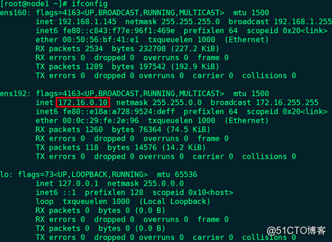

（2）node2新增一块网卡，并配置内网IP：

    # vim /etc/sysconfig/network-scripts/ifcfg-ens192


    # systemctl restart network.service
    
    # ifconfig

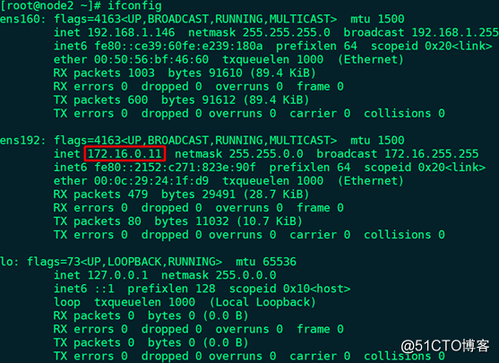

（3）web1配置内网IP：

    # vim /etc/sysconfig/network-scripts/ifcfg-ens160


    # systemctl restart network.service
    
    # ifconfig

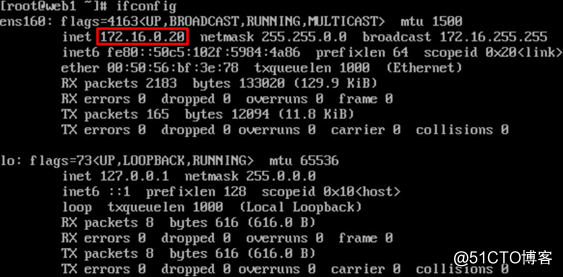

（4）web2配置内网IP：

    # vim /etc/sysconfig/network-scripts/ifcfg-ens160


    # systemctl restart network.service
    
    # ifconfig

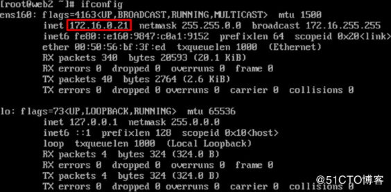

3、node1和node2通过chrony服务同步时间

4、各节点关闭firewalld和SELinux

5、node1和node2实现通过主机名互相通信：

    # vim /etc/hosts

    192.168.1.145 node1
    
    192.168.1.146 node2

node1：

    # ping -c 3 node2

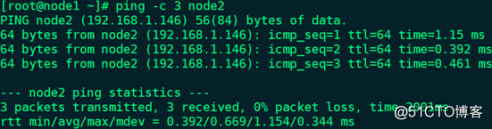

    # ping -c 3 172.16.0.11

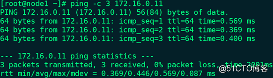

node2：

    # ping -c 3 node1

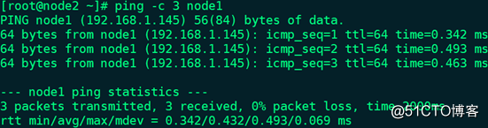

    # ping -c 3 172.16.0.10

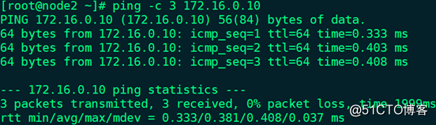

6、确保配置keepalived服务的node1和node2用于集群服务的接口支持MULTICAST（多播或组播）通信：

node1：# ip a l | grep MULTICAST


node2：# ip a l | grep MULTICAST

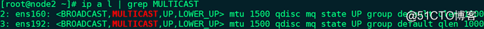

备注：如果网卡没有开启多播功能，可通过命令# ip link set multicast on dev ens160开启

7、web1安装部署httpd：

    # yum -y install httpd
    
    # vim /var/www/html/index.html --> <h1>web1</h1>
    
    # systemctl start httpd.service
    
    # ss -tunlp | grep -w :80
    
    # systemctl enable httpd.service

8、web2安装部署httpd：

    # yum -y install httpd
    
    # vim /var/www/html/index.html --> <h1>web2</h1>
    
    # systemctl start httpd.service
    
    # ss -tunlp | grep -w :80
    
    # systemctl enable httpd.service

9、node1访问web1和web2：

    # curl http://172.16.0.20


    # curl http://172.16.0.21


10、node1安装配置keepalived：

    # yum -y install keepalived
    
    # cd /etc/keepalived
    
    # mv keepalived.conf{,.bak}
    
    # openssl rand -base64 7 --> IDDf1j+yfw==
    
    # vim keepalived.conf

```
global_defs {

notification_email {

root@localhost

}

notification_email_from node1@localhost

smtp_server 127.0.0.1

smtp_connect_timeout 30

router_id node1

vrrp_mcast_group4 224.1.100.88

}


vrrp_instance VI_1 {

state MASTER

interface ens160

virtual_router_id 50

priority 100

advert_int 1

authentication {

auth_type PASS

auth_pass IDDf1j+yfw==

}

virtual_ipaddress {

192.168.1.119

}

track_interface {

ens160

ens192

}

notify_master "/etc/keepalived/notify.sh master"

notify_backup "/etc/keepalived/notify.sh backup"

notify_fault "/etc/keepalived/notify.sh fault"

}
```

11、node2安装配置keepalived：

    # yum -y install keepalived
    
    # cd /etc/keepalived
    
    # mv keepalived.conf{,.bak}
    
    # vim keepalived.conf

```
global_defs {

notification_email {

root@localhost

}

notification_email_from node2@localhost

smtp_server 127.0.0.1

smtp_connect_timeout 30

router_id node2

vrrp_mcast_group4 224.1.100.88

}


vrrp_instance VI_1 {

state BACKUP

interface ens160

virtual_router_id 50

priority 98

advert_int 1

authentication {

auth_type PASS

auth_pass IDDf1j+yfw==

}

virtual_ipaddress {

192.168.1.119

}

track_interface {

ens160

ens192

}

notify_master "/etc/keepalived/notify.sh master"

notify_backup "/etc/keepalived/notify.sh backup"

notify_fault "/etc/keepalived/notify.sh fault"

}
```

12、node1定义邮件通知脚本：

    # vim /etc/keepalived/notify.sh


```
#!/bin/bash

contact='root@localhost'

notify() {

local mailsubject="$(hostname) to be $1, vip floating"

local mailbody="$(date +'%F %T'): vrrp transition, $(hostname) changed to be $1"

echo "$mailbody" | mail -s "$mailsubject" $contact

}

case $1 in

master)

notify master

;;

backup)

notify backup

;;

fault)

notify fault

;;

*)

echo "Usage: $(basename $0) {master|backup|fault}"

exit 1

;;

esac
```

    # chmod +x /etc/keepalived/notify.sh
    
    # bash -n /etc/keepalived/notify.sh
    
    # scp -p /etc/keepalived/notify.sh root@192.168.1.146:/etc/keepalived

13、node1定义在不停止keepalived服务的情况下进行主备切换测试的脚本：

    # vim /etc/keepalived/chk_maint.sh

```
#!/bin/bash

if [ -f /etc/keepalived/maint ]; then

exit 1

else

exit 0

fi
```

    # chmod +x /etc/keepalived/chk_maint.sh
    
    # bash -n /etc/keepalived/chk_maint.sh
    
    # scp -p /etc/keepalived/chk_maint.sh root@192.168.1.146:/etc/keepalived

14、node1修改配置文件：

    # vim /etc/keepalived/keepalived.conf

```
global_defs {

notification_email {

root@localhost

}

notification_email_from node1@localhost

smtp_server 127.0.0.1

smtp_connect_timeout 30

router_id node1

vrrp_mcast_group4 224.1.100.88

}


vrrp_script chk_maint {

script "/etc/keepalived/chk_maint.sh"

interval 1

weight -5

}


vrrp_instance VI_1 {

state MASTER

interface ens160

virtual_router_id 50

priority 100

advert_int 1

authentication {

auth_type PASS

auth_pass IDDf1j+yfw==

}

virtual_ipaddress {

192.168.1.119

}

track_interface {

ens160

ens192

}

track_script {

chk_maint

}

notify_master "/etc/keepalived/notify.sh master"

notify_backup "/etc/keepalived/notify.sh backup"

notify_fault "/etc/keepalived/notify.sh fault"

}
```

备注：如果/etc/keepalived/maint文件存在，则权重-5

15、node2修改配置文件：

    # vim /etc/keepalived/keepalived.conf

```
global_defs {

notification_email {

root@localhost

}

notification_email_from node2@localhost

smtp_server 127.0.0.1

smtp_connect_timeout 30

router_id node2

vrrp_mcast_group4 224.1.100.88

}


vrrp_script chk_maint {

script "/etc/keepalived/chk_maint.sh"

interval 1

weight -5

}


vrrp_instance VI_1 {

state BACKUP

interface ens160

virtual_router_id 50

priority 98

advert_int 1

authentication {

auth_type PASS

auth_pass IDDf1j+yfw==

}

virtual_ipaddress {

192.168.1.119

}

track_interface {

ens160

ens192

}

track_script {

chk_maint

}

notify_master "/etc/keepalived/notify.sh master"

notify_backup "/etc/keepalived/notify.sh backup"

notify_fault "/etc/keepalived/notify.sh fault"

}
```

16、启动优先级较低的node2上的keepalived服务，并查看VIP信息：

    # systemctl start keepalived.service
    
    # systemctl enable keepalived.service
    
    # ip a l


17、启动优先级较高的node1上的keepalived服务，并查看VIP信息：

    # systemctl start keepalived.service
    
    # systemctl enable keepalived.service
    
    # ip a l


18、node1创建maint文件，并查看VIP信息：

    # touch /etc/keepalived/maint
    
    # ip a l

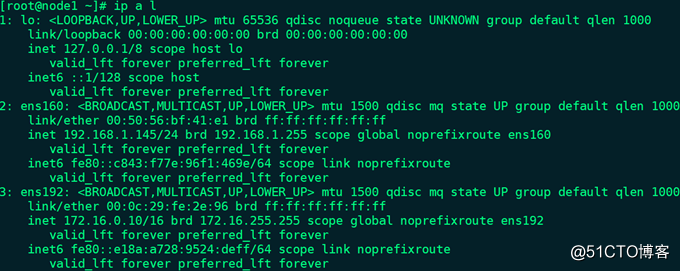

备注：VIP地址已经转移至node2

19、node1删除maint文件，并查看VIP信息：

    # rm -rf /etc/keepalived/maint
    
    # ip a l


备注：VIP地址又转移回node1

20、node1安装配置nginx：

    # yum -y install nginx
    
    # cd /etc/nginx
    
    # cp nginx.conf{,.bak}
    
    # vim nginx.conf

（1）在http配置段内、server配置段外新增如下代码：

```
upstream websrvs {

server 172.16.0.20;

server 172.16.0.21;

}
```

（2）在server配置段内新增如下代码：

```
location / {

proxy_pass http://websrvs;

}
```

    # nginx -t
    
    # systemctl start nginx.service
    
    # ss -tunlp | grep -w :80
    
    # systemctl enable nginx.service

备注：node2同样需要执行上述操作

21、使用其它主机访问node1、node2和VIP：


    # for i in {1..4}; do curl http://192.168.1.145; done


    # for i in {1..4}; do curl http://192.168.1.146; done


    # for i in {1..4}; do curl http://192.168.1.119; done


22、node1定义nginx进程监控脚本：

    # vim /etc/keepalived/chk_nginx.sh

```
#!/bin/bash

A=$(ps -C nginx --no-headers | wc -l)

if [ $A -eq 0 ]; then

systemctl start nginx.service

sleep3

B=`ps -C nginx --no-headers | wc -l`

if [ $B -eq 0 ]; then

systemctl stop keepalived.service

fi

fi
```

    # chmod +x /etc/keepalived/chk_nginx.sh
    
    # bash -n /etc/keepalived/chk_nginx.sh
    
    # scp -p /etc/keepalived/chk_nginx.sh root@192.168.1.146:/etc/keepalived

备注：检查nginx是否运行，如果没有运行就启动nginx；如果nginx启动失败，则停止keepalived

23、node1停止keepalived服务，并修改配置文件：

    # systemctl stop keepalived.service
    
    # vim /etc/keepalived/keepalived.conf

```
global_defs {

notification_email {

root@localhost

}

notification_email_from node1@localhost

smtp_server 127.0.0.1

smtp_connect_timeout 30

router_id node1

vrrp_mcast_group4 224.1.100.88

}


vrrp_script chk_maint {

script "/etc/keepalived/chk_maint.sh"

interval 1

weight -5

}


vrrp_script chk_nginx {

script "/etc/keepalived/chk_nginx.sh"

interval 5

}


vrrp_instance VI_1 {

state MASTER

interface ens160

virtual_router_id 50

priority 100

advert_int 1

authentication {

auth_type PASS

auth_pass IDDf1j+yfw==

}

virtual_ipaddress {

192.168.1.119

}

track_interface {

ens160

ens192

}

track_script {

chk_maint

chk_nginx

}

notify_master "/etc/keepalived/notify.sh master"

notify_backup "/etc/keepalived/notify.sh backup"

notify_fault "/etc/keepalived/notify.sh fault"

}
```

24、node2停止keepalived服务，并修改配置文件：

    # systemctl stop keepalived.service
    
    # vim /etc/keepalived/keepalived.conf

```
global_defs {

notification_email {

root@localhost

}

notification_email_from node2@localhost

smtp_server 127.0.0.1

smtp_connect_timeout 30

router_id node2

vrrp_mcast_group4 224.1.100.88

}


vrrp_script chk_maint {

script "/etc/keepalived/chk_maint.sh"

interval 1

weight -5

}


vrrp_script chk_nginx {

script "/etc/keepalived/chk_nginx.sh"

interval 5

}


vrrp_instance VI_1 {

state BACKUP

interface ens160

virtual_router_id 50

priority 98

advert_int 1

authentication {

auth_type PASS

auth_pass IDDf1j+yfw==

}

virtual_ipaddress {

192.168.1.119

}

track_interface {

ens160

ens192

}

track_script {

chk_maint

chk_nginx

}

notify_master "/etc/keepalived/notify.sh master"

notify_backup "/etc/keepalived/notify.sh backup"

notify_fault "/etc/keepalived/notify.sh fault"

}
```

25、分别启动node1和node2上的keepalived服务：

`# systemctl start keepalived.service`

备注：此时node1和node2上都运行着keepalived和nginx，且node1为主节点，绑定VIP

26、高可用测试：

（1）node1停止keepalived：VIP漂移至node2

（2）node1创建/etc/keepalived/maint文件：VIP漂移至node2

（3）node1停止nginx：VIP仍然绑定在node1上，且nginx会自动启动

（4）node1安装httpd，并且在停止nginx的同时启动httpd：# killall nginx && systemctl start httpd.service，由于80端口被httpd占用，所以node1上的nginx无法正常启动，根据chk_nginx.sh脚本，继而停止node1上的keepalived，导致VIP漂移至node2，但仍不影响VIP的访问：

    # for i in {1..4}; do curl http://192.168.1.119; done


（5）后端real server服务器健康状态检测，停止web2上的httpd，访问VIP：

    # for i in {1..4}; do curl http://192.168.1.119; done


备注：每次测试后都恢复至步骤25的状态

27、node1停止keepalived服务，并修改配置文件，配置高可用nginx双主模型：

    # systemctl stop keepalived.service
    
    # openssl rand -base64 7 --> 9xEKWUjHZw==
    
    # vim /etc/keepalived/keepalived.conf

```
global_defs {

notification_email {

root@localhost

}

notification_email_from node1@localhost

smtp_server 127.0.0.1

smtp_connect_timeout 30

router_id node1

vrrp_mcast_group4 224.1.100.88

}


vrrp_script chk_maint {

script "/etc/keepalived/chk_maint.sh"

interval 1

weight -5

}


vrrp_script chk_nginx {

script "/etc/keepalived/chk_nginx.sh"

interval 5

}


vrrp_instance VI_1 {

state MASTER

interface ens160

virtual_router_id 50

priority 100

advert_int 1

authentication {

auth_type PASS

auth_pass IDDf1j+yfw==

}

virtual_ipaddress {

192.168.1.119

}

track_interface {

ens160

ens192

}

track_script {

chk_maint

chk_nginx

}

notify_master "/etc/keepalived/notify.sh master"

notify_backup "/etc/keepalived/notify.sh backup"

notify_fault "/etc/keepalived/notify.sh fault"

}


vrrp_instance VI_2 {

state BACKUP

interface ens160

virtual_router_id 51

priority 98

advert_int 1

authentication {

auth_type PASS

auth_pass 9xEKWUjHZw==

}

virtual_ipaddress {

192.168.1.118

}

track_interface {

ens160

ens192

}

track_script {

chk_maint

chk_nginx

}

notify_master "/etc/keepalived/notify.sh master"

notify_backup "/etc/keepalived/notify.sh backup"

notify_fault "/etc/keepalived/notify.sh fault"

}
```

28、node2停止keepalived服务，并修改配置文件，配置高可用nginx双主模型：

    # systemctl stop keepalived.service
    
    # vim /etc/keepalived/keepalived.conf

```
global_defs {

notification_email {

root@localhost

}

notification_email_from node2@localhost

smtp_server 127.0.0.1

smtp_connect_timeout 30

router_id node2

vrrp_mcast_group4 224.1.100.88

}


vrrp_script chk_maint {

script "/etc/keepalived/chk_maint.sh"

interval 1

weight -5

}


vrrp_script chk_nginx {

script "/etc/keepalived/chk_nginx.sh"

interval 5

}


vrrp_instance VI_1 {

state BACKUP

interface ens160

virtual_router_id 50

priority 98

advert_int 1

authentication {

auth_type PASS

auth_pass IDDf1j+yfw==

}

virtual_ipaddress {

192.168.1.119

}

track_interface {

ens160

ens192

}

track_script {

chk_maint

chk_nginx

}

notify_master "/etc/keepalived/notify.sh master"

notify_backup "/etc/keepalived/notify.sh backup"

notify_fault "/etc/keepalived/notify.sh fault"

}


vrrp_instance VI_2 {

state MASTER

interface ens160

virtual_router_id 51

priority 100

advert_int 1

authentication {

auth_type PASS

auth_pass 9xEKWUjHZw==

}

virtual_ipaddress {

192.168.1.118

}

track_interface {

ens160

ens192

}

track_script {

chk_maint

chk_nginx

}

notify_master "/etc/keepalived/notify.sh master"

notify_backup "/etc/keepalived/notify.sh backup"

notify_fault "/etc/keepalived/notify.sh fault"

}
```

29、分别启动node1和node2上的keepalived服务：

`# systemctl start keepalived.service`

30、node1查看VIP信息：`# ip a l`

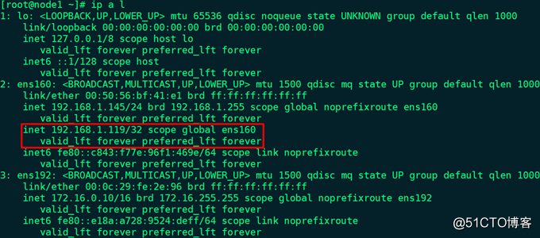

31、node2查看VIP信息：`# ip a l`

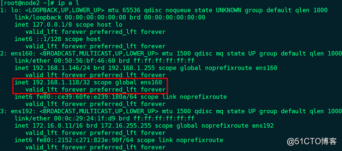

32、使用其它主机访问2个VIP：

    # for i in {1..4}; do curl http://192.168.1.119; done


    # for i in {1..4}; do curl http://192.168.1.118; done


备注：

Ø  此处2个VIP均为外网VIP，内网无需配置VIP

Ø  DNS服务主从，将域名的2条A记录分别解析为上述2个VIP，通过主/备和备/主实现负载均衡

33、双主模型高可用测试：

（1）node2停止keepalived：2个VIP都绑定至node1

（2）node2创建/etc/keepalived/maint文件：2个VIP都绑定至node1

（3）node2停止nginx：VIP 192.168.1.118仍然绑定在node2上，且nginx会自动启动

（4）node2安装httpd，并且在停止nginx的同时启动httpd：# killall nginx && systemctl start httpd.service，由于80端口被httpd占用，所以node2上的nginx无法正常启动，根据chk_nginx.sh脚本，继而停止node2上的keepalived，导致VIP 192.168.1.118漂移至node1，但仍不影响2个VIP的访问：

    # for i in {1..4}; do curl http://192.168.1.119; done


    # for i in {1..4}; do curl http://192.168.1.118; done


（5）后端real server服务器健康状态检测，停止web1上的httpd，访问2个VIP：

    # for i in {1..4}; do curl http://192.168.1.119; done


    # for i in {1..4}; do curl http://192.168.1.118; done


备注：每次测试后都恢复至步骤25的状态