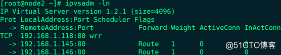
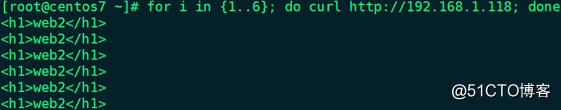

# CentOS 7.6安装配置Keepalived详解（二）：高可用IPVS DR模型 #

1、演示环境：

|IP|操作系统|主机名|部署服务|

|192.168.1.143|CentOS   7.6 x86_64|node1|keepalived、nginx|

|192.168.1.144|CentOS   7.6 x86_64|node2|keepalived、nginx|

|192.168.1.145|CentOS   7.6 x86_64|web1|httpd|

|192.168.1.146|CentOS   7.6 x86_64|web2|httpd|

 
2、各节点通过chrony服务同步时间

3、各节点关闭firewalld和SELinux

4、node1和node2实现通过主机名互相通信：

    # vim /etc/hosts

    192.168.1.143 node1
    
    192.168.1.144 node2
    
node1 ping node2：# ping -c 3 node2


node2 ping node1：# ping -c 3 node1


5、确保配置keepalived服务的node1和node2用于集群服务的接口支持MULTICAST（多播或组播）通信：

node1：# ip a l | grep MULTICAST


node2：# ip a l | grep MULTICAST


备注：如果网卡没有开启多播功能，可通过命令`# ip link set multicast on dev ens160`开启

6、web1安装部署httpd：

    # yum -y install httpd
    
    # vim /var/www/html/index.html --> <h1>web1</h1>
    
    # systemctl start httpd.service
    
    # ss -tunlp | grep -w :80
    
    # systemctl enable httpd.service

7、web2安装部署httpd：

    # yum -y install httpd
    
    # vim /var/www/html/index.html --> <h1>web2</h1>
    
    # systemctl start httpd.service
    
    # ss -tunlp | grep -w :80
    
    # systemctl enable httpd.service

8、node1访问web1和web2：

    # curl http://192.168.1.145


    # curl http://192.168.1.146


9、web1调整内核参数：

    # cd /root
    
    # vim kernel.sh

内容如下：

```
#!/bin/bash

vip='192.168.1.118'

netmask='255.255.255.255'

iface='lo:0'

case $1 in

start)

echo 1 > /proc/sys/net/ipv4/conf/all/arp_ignore

echo 1 > /proc/sys/net/ipv4/conf/lo/arp_ignore

echo 2 > /proc/sys/net/ipv4/conf/all/arp_announce

echo 2 > /proc/sys/net/ipv4/conf/lo/arp_announce

ifconfig $iface $vip netmask $netmask broadcast $vip up

route add -host $vip dev $iface

;;

stop)

ifconfig $iface down

echo 0 > /proc/sys/net/ipv4/conf/all/arp_ignore

echo 0 > /proc/sys/net/ipv4/conf/lo/arp_ignore

echo 0 > /proc/sys/net/ipv4/conf/all/arp_announce

echo 0 > /proc/sys/net/ipv4/conf/lo/arp_announce

;;

*)

exit 1

;;

esac
```

执行一下脚本：

    # chmod +x kernel.sh
    
    # bash -n kernel.sh
    
    # bash -x kernel.sh start


    # ifconfig


    # route -n


    # scp -p /root/kernel.sh root@192.168.1.146:/root

备注：web2同样需要调整内核参数，在web2上执行`# ./kernel.sh start`

10、node1安装keepalived和ipvsadm：

    # yum -y install keepalived ipvsadm

备注：

- 此处ipvsadm仅用于查看IPVS规则，而非用于生成IPVS规则
- node2同样需要安装keepalived和ipvsadm

11、node1配置virtual_server和real_server：

    # cd /etc/keepalived
    
    # mv keepalived.conf{,.bak}
    
    # openssl rand -base64 7 --> IDDf1j+yfw==
    
    # vim keepalived.conf

内容如下：

```
global_defs {

notification_email {

root@localhost

}

notification_email_from node1@localhost

smtp_server 127.0.0.1

smtp_connect_timeout 30

router_id node1

vrrp_mcast_group4 224.1.100.88

}


vrrp_instance VI_1 {

state MASTER

interface ens160

virtual_router_id 50

priority 100

advert_int 1

authentication {

auth_type PASS

auth_pass IDDf1j+yfw==

}

virtual_ipaddress {

192.168.1.118

}

notify_master "/etc/keepalived/notify.sh master"

notify_backup "/etc/keepalived/notify.sh backup"

notify_fault "/etc/keepalived/notify.sh fault"

}


virtual_server 192.168.1.118 80 {

delay_loop 1

lb_algo wrr

lb_kind DR

protocol TCP

sorry_server 127.0.0.1 80


real_server 192.168.1.145 80 {

weight 1

HTTP_GET {

url {

path /index.html

status_code 200

}

connect_timeout 3

nb_get_retry 3

delay_before_retry 2

}

}


real_server 192.168.1.146 80 {

weight 1

TCP_CHECK {

connect_timeout 3

retry 3

delay_before_retry 2

}

}

}
```

备注：常用指令说明

- delay_loop：服务轮询的时间间隔，单位秒
- lb_algo：定义的调度算法
- lb_kind：定义的集群类型
- protocol TCP：仅支持TCP协议
- sorry_server：备用服务器地址和端口
- HTTP_GET：定义当前主机的健康状态检测方法为应用层检测
- path：定义要监控的URL
- status_code：判断上述检测方法为健康状态的响应码
- connect_timeout：连接请求的超时时长
- nb_get_retry：重试次数
- delay_before_retry：每次重试的时间间隔，单位秒
- TCP_CHECK：定义当前主机的健康状态检测方法为传输层检测
- connect_ip：向当前real_server的哪个IP地址发起健康状态检测请求
- connect_port：向当前real_server的哪个端口发起健康状态检测请求
- bindto：发出健康状态检测请求时使用的源地址
- bind_port：发出健康状态检测请求时使用的源端口

12、node2配置virtual_server和real_server：

    # cd /etc/keepalived
    
    # mv keepalived.conf{,.bak}
    
    # vim keepalived.conf

```
global_defs {

notification_email {

root@localhost

}

notification_email_from node2@localhost

smtp_server 127.0.0.1

smtp_connect_timeout 30

router_id node2

vrrp_mcast_group4 224.1.100.88

}


vrrp_instance VI_1 {

state BACKUP

interface ens160

virtual_router_id 50

priority 98

advert_int 1

authentication {

auth_type PASS

auth_pass IDDf1j+yfw==

}

virtual_ipaddress {

192.168.1.118

}

notify_master "/etc/keepalived/notify.sh master"

notify_backup "/etc/keepalived/notify.sh backup"

notify_fault "/etc/keepalived/notify.sh fault"

}


virtual_server 192.168.1.118 80 {

delay_loop 1

lb_algo wrr

lb_kind DR

protocol TCP

sorry_server 127.0.0.1 80


real_server 192.168.1.145 80 {

weight 1

HTTP_GET {

url {

path /index.html

status_code 200

}

connect_timeout 3

nb_get_retry 3

delay_before_retry 2

}

}


real_server 192.168.1.146 80 {

weight 1

TCP_CHECK {

connect_timeout 3

retry 3

delay_before_retry 2

}

}

}
```

13、node1配置sorry_server：

    # yum -y install nginx
    
    # cd /usr/share/nginx/html
    
    # mv index.html index.html.bak
    
    # vim index.html --> <h1>sorry_server-node1</h1>
    
    # systemctl start nginx.service
    
    # ss -tunlp | grep -w :80
    
    # systemctl enable nginx.service

14、node2配置sorry_server：

    # yum -y install nginx
    
    # cd /usr/share/nginx/html
    
    # mv index.html index.html.bak
    
    # vim index.html --> <h1>sorry_server-node2</h1>
    
    # systemctl start nginx.service
    
    # ss -tunlp | grep -w :80
    
    # systemctl enable nginx.service

15、node1定义邮件通知脚本：

    # cd /etc/keepalived
    
    # vim notify.sh

```
#!/bin/bash

contact='root@localhost'

notify() {

local mailsubject="$(hostname) to be $1, vip floating"

local mailbody="$(date +'%F %T'): vrrp transition, $(hostname) changed to be $1"

echo "$mailbody" | mail -s "$mailsubject" $contact

}

case $1 in

master)

notify master

;;

backup)

notify backup

;;

fault)

notify fault

;;

*)

echo "Usage: $(basename $0) {master|backup|fault}"

exit 1

;;

esac
```

    # chmod +x notify.sh
    
    # bash -n notify.sh
    
    # scp -p notify.sh root@192.168.1.144:/etc/keepalived


16、启动优先级较低的node2上的keepalived服务，并查看VIP信息和IPVS规则：

    # systemctl start keepalived.service
    
    # systemctl enable keepalived.service
    
    # ip a l


备注：由于node1没有启动，所以在默认的抢占模式下，node2启动后由BACKUP变成MASTER。

    # ipvsadm -ln



17、用其它主机访问VIP：# for i in {1..6}; do curl http://192.168.1.118; done


18、启动优先级较高的node1上的keepalived服务，并查看VIP信息和IPVS规则：

    # systemctl start keepalived.service
    
    # systemctl enable keepalived.service
    
    # ip a l


    # ipvsadm -ln


备注：node1和node2都具有IPVS规则（除非停止keepalived服务），且具有VIP的MASTER提供服务。

19、用其它主机访问VIP：

`# for i in {1..6}; do curl http://192.168.1.118; done`


20、停止web1上的httpd服务：

`# systemctl stop httpd.service`

21、node1查看IPVS规则及邮件信息：

    # ipvsadm -ln


    # mail


22、用其它主机访问VIP：

`# for i in {1..6}; do curl http://192.168.1.118; done`



23、停止web2上的httpd服务：

`# systemctl stop httpd.service`

24、node1查看IPVS规则及邮件信息：

    # ipvsadm -ln


备注：后端的real_server（web1和web2）服务都宕了，sorry_server才会提供服务。

    # mail


25、用其它主机访问VIP：

`# for i in {1..6}; do curl http://192.168.1.118; done`


26、启动web1上的httpd服务：

`# systemctl start httpd.service`

27、node1查看IPVS规则及邮件信息：

    # ipvsadm -ln


    # mail


28、用其它主机访问VIP：

`# for i in {1..6}; do curl http://192.168.1.118; done`


29、启动web2上的httpd服务：

`# systemctl start httpd.service`

30、node1查看IPVS规则及邮件信息：

    # ipvsadm -ln


    # mail


31、用其它主机访问VIP：

`# for i in {1..6}; do curl http://192.168.1.118; done`

