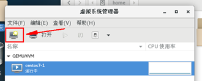
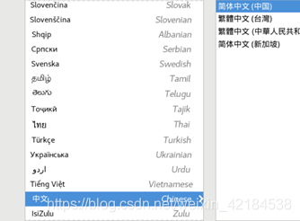

# CentOS7安装kvm并配置网络连接 #

前言：

（1）以下称安装kvm的主机为宿主机，通过kvm安装的为虚拟机----请注意区分！！！

（2）安装完成kvm后，若网络连接正常，则无需进行配置网络连接;

（3）虚拟化第二台及以上服务器时直接从安装kvm的5开始，请注意配置网络连接的注意2；

（4）装虚拟机前一定要先看第二部分的5！！！


## ●第一部分：安装kvm步骤 ##

**1. 前期准备**

（1）若是在WIN系统下的vmware中的虚拟机测试安装kvm，安装宿主机系统时需要提前开启虚拟化引擎


（2）检查要装kvm的宿主机系统是否支持虚拟化。若不支持则停止往下进行！一般情况下，不支持kvm的情况只存在于在vmware中安装的宿主机未开启虚拟化引擎的时候。简单来说，kvm就是Win系统下的vmware，也是一款软件，当然linux下也有vmware，两者区别自行谷歌 / 百度。
检查命令如下：

    egrep '(vmx|svm)' /proc/cpuinfo


<要有 vmx 或 svm 的标识才行，否则不支持虚拟化，则无需再往下看！vmx标识intel，svm代表AMD>

（3）上传centos镜像，用于kvm装虚拟机使用，对上传路径无特殊要求 。安装完kvm后再上传也是可以的。

**2. 在宿主机中安装kvm及相关工具**

```
yum -y install libvirt

yum -y install epel*

yum -y install virt-manager

yum -y install kvm

yum -y install qemu*
```

顺序安装即可，centos7正常情况下，以上5步不会报错

<经测试：Centos6会报错，centos6本文章适用，但是出错请自行百度，或参考其他文章进行配置kvm>

**3.安装完成后，在宿主机中开启虚拟机管理工具**

（1）方法1：宿主机命令执行

    virt-manager

（2）方法2：用下图中的服务器连接工具远程打开


**4.打开管理工具如下图所示**


## ●第二部分：安装虚拟机 ##

1.点击创建虚拟机



2.直接下一步


3.点击浏览


4.输入一个名字后点击前进


**5.点击完成即可**

注意！！！这一步的路径建议选择/home<或是你的宿主机存储最大路径>下，系统默认情况下/var空间很小，应在装虚拟机前在home下按照虚拟机个数新建多个文件夹，例如若4个虚拟机则在/home/libvirt/images下新建如下


**6.添加卷**


**7.配置名字+空间大小<空间大小>**


**8.完成后，点击”本地浏览”，选择镜像**


**9.根据存放的位置进行查找即可，找到后选择并点击右上角的打开**


**10.根据实际需求修改配置并点击前进**


**11.选择刚添加的卷**


**12.确认名称及存储位置点击完成即可**


**13.出现下图界面说明镜像正常，配置语言及其他配置**



选择安装位置

（补充：下图右上角的软件安装，若需要图形化操作界面切记要点进去进行选择！）


开始安装


密码设置


**14.完成后重启即可**


## ●第三部分：配置网络连接 ##

<注意1：网卡名称不一定与下图示例中的一样，根据自己电脑网卡名进行配置即可>

<注意2：虚拟化第二台及以上服务器时直接从3开始！！！共享第一台虚拟机的桥。IP需要修改！！！不可与宿主机或其他虚拟机相同>

**1.在宿主机中创建br0网卡**

1.1查看当前使用的网卡名称

输入 ifconfig 命令，查看当前链接的IP地址对应的网卡名称

    ifconfig


1.2创建桥接网卡

1.2.1进入到网卡配置路径

    cd /etc/sysconfig/network-scripts/

1.2.2备份当前网卡文件信息

    cp ifcfg-eno16777736 ./ifcfg-eno16777736.bak

1.2.3创建桥接网卡命令

    virsh iface-bridge eno16777736 br0

1.2.4查看网卡列表中新增了br0网卡

**ll /etc/sysconfig/network-scripts/ifcfg-***


<补充操作：若第3步执行创建桥接命令后，发现远程连接工具无法连接宿主机，采取以下步骤，若连接正常跳过此步骤>

<1>直接在宿主机中操作,进入网卡配置文件夹下

    cd /etc/sysconfig/network-scripts/

此时已经存在新建的桥接网卡的配置文件


进入到ifcfg-br0中,将缺少项补充，参考下图
IPADDR为第一步中记录的ip地址，网关最后一位为1

    vi ifcfg-br0


修改好后重启网络服务

    systemctl restart network

再次执行ifconfig，此时网卡正常，连接工具可以正常连接宿主机


此时两个网卡的配置信息如下图(图一为br0，图二为eno16777736)
/etc/sysconfig/network-scripts下

    vi ifcfg-br0
    vi ifcfg-eno16777736


**2.配置虚拟机桥接网络，修改虚拟机的网卡为桥接模式**

2.1关闭正在运行的虚拟机<执行下方命令或直接在管理工具中关机>

方法一：

1.查看虚拟机是否在运行

    virsh list --all

2.如果运行则执行下面的命令关闭虚拟机

**virsh destroy 虚拟机名称**

方法二：命令virt-manager打开管理工具,鼠标右键单击虚拟机(如下图)


2.2关闭虚拟机后配置虚拟机网卡信息

修改虚拟机网卡配置信息，找到interface配置位置，修改前显示type类型是network

（1）进入下面的目录

     cd /etc/libvirt/qemu

（2）修改虚拟机的配置文件

    vim 虚拟机名称.xml


（3）修改内容和上面一样<主要修改bridge和network的名字>

```
<interface type='bridge'>
      <mac address='52:54:00:84:1d:dc'/>
      <source network='br0'/>
      <model type='virtio'/>
      <address type='pci' domain='0x0000' bus='0x00' slot='0x03' function='0x0'/>
</interface>
```


（4）启动虚拟机(命令启动或管理工具内右键点击启动)

    virsh start 虚拟机名称


（5）VNC连接虚拟机配置网卡信息,网络改为桥接网卡

①右键单击虚拟机，并点击打开


②点击此处打开配置(如下图)


③修改虚拟网络接口网络源为桥接


**3.修改网卡配置**

3.1进入虚拟机的网卡配置路径

    cd /etc/sysconfig/network-scripts/

3.2修改网卡信息

只需要添加下面有注释的几行即可

    vi ifcfg-eth0


进入后添加如下几行，若有则无需再次添加

```
ONBOOT=yes
BOOTPROTO=static  # static是静态IP
IPADDR=192.168.221.122  # 同宿主机在一个网段的IP地址即可，不可与原服务器相同
NETMASK=255.255.255.0  # 同宿主机网段
GATEWAY=192.168.221.1  # 同宿主机网关相同
#DNS1=114.114.114.114  # 同宿主机DNS相同，不加也可以
```

**4.关闭虚拟机网络管理服务**

#查看网络管理服务是否启动

    systemctl status NetworkManager

显示active (running)就是启动状态

```
NetworkManager.service - Network Manager
Loaded: loaded (/usr/lib/systemd/system/NetworkManager.service; enabled; vendor preset: enabled)
Active: active (running) since \u4e8c 2020-09-29 10:41:17 CST; 6min ago
Docs: man:NetworkManager(8)
Main PID: 553 (NetworkManager)
CGroup: /system.slice/NetworkManager.service
\u2514\u2500553 /usr/sbin/NetworkManager --no-daemon
```

#关闭网络管理服务

    systemctl stop NetworkManager

**5.重启虚拟机网卡**

    systemctl restart network

#查看IP地址是否生效

    ifconfig

或

    ip addr


6.验证宿主机与虚拟机是否可连接

    ping 宿主机IP


此时可通过服务器连接工具进行连接，完成!

## ●第四部分：可能遇见的问题 ##

**1.虚拟机网络服务重启失败**

答：①检查虚拟机中的网卡IP设置，此项不可与宿主机相同！②同样是虚拟机的网卡配置中ONBOOT=yes此项一定要为yes

**2.虚拟化第二台服务器配置网络环节出错**

答：除虚拟化第一台外，配置网络连接步骤中请直接从3开始，无需再次创建网桥，共享第一次创建的网桥；

————————————————

版权声明：本文为CSDN博主「悟空宇」的原创文章，遵循CC 4.0 BY-SA版权协议，转载请附上原文出处链接及本声明。

原文链接：https://blog.csdn.net/weixin_42184538/article/details/109485017