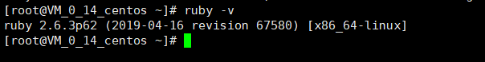

# CentOS7安装ruby2.6.3 #

最近学redis集群搭建，需要安装ruby。用yum安装的版本过低。需要升级。试过离线安装，总是不成功。在安装的时候总是报编译错误. 三天了，也不知道问题出在哪儿。 参考了两篇博文，终于通过rvm成功将ruby升级到了最新版.现记录一下步骤.

## 一 安装ruby  ##

1 查看系统当前ruby版本,可知未安装ruby

　　`ruby -v  `


2 通过yum安装ruby 和依赖的包

　　`yum -y install ruby ruby-devel rubygems rpm-build`


3 查看当前ruby版本，2.0.0版本过低, redis5.0.5 要求ruby版本要大于2.3.0  

　　`ruby -v`


 

## 二 安装rvm ##

1 安装ruby所需的其他依赖包  （其实我也不知道这些依赖包当中哪些是多余的，但是鉴于之前离线安装的时候老是提示少库，先都安装上再说）

```
yum install gcc-c++ patch readline readline-devel zlib zlib-devel \
 libyaml-devel libffi-devel openssl-devel make \
 bzip2 autoconf automake libtool bison iconv-devel sqlite-devel
```


2 修改ruby的gem源(改为国内的镜像，国外的实在是太慢了),截图略

```
   2.1　　gem sources 　　--查看当前使用的源地址
   2.2　　gem sources -a http://mirrors.aliyun.com/rubygems/ 　　 --添加阿里云镜像地址
   2.3　　gem sources -r https://rubygems.org/ 　　 --删除默认的源地址
   2.4　　gem sources -u 　　 --更新源的缓存
```
 

3 安装rvm 

  3.1　　`gpg --keyserver hkp://keys.gnupg.net --recv-keys 409B6B1796C275462A1703113804BB82D39DC0E3 7D2BAF1CF37B13E2069D6956105BD0E739499BDB`　　　　--获取密钥


 

  3.2　　`curl -sSL https://get.rvm.io | bash -s stable`　　--安装rvm


  3.3　　`source /etc/profile.d/rvm.sh`　　　　--更新配置文件


 

## 三 通过rvm升级ruby到2.6.3  ##

1 `rvm list known`　　　　--查看所有可安装版本


2 `rvm install 2.6`　　　　--安装ruby2.6.3

出现如下图表示安装成功


3 `rvm -v` 　　　　--查看当前ruby版本



 

至此，ruby安装成功。

感谢如下两篇帖子的作者..

 https://blog.csdn.net/qq_26440803/article/details/82717244

https://blog.csdn.net/u011790603/article/details/82663913