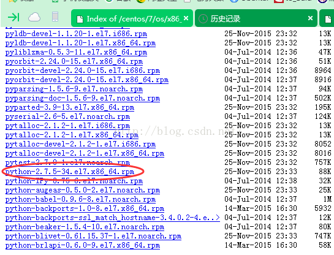
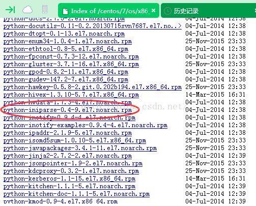
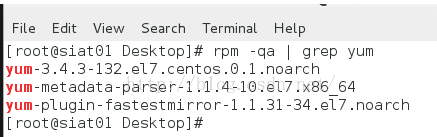

# CentOS下安装yum源的流程和操作 #

一般公司都用Linux来搭建服务器，Linux安装软件时能够用yum安装依赖包是一件非常简单而幸福的事情，因为你只需一个简单的安装命令yum install []即可安装相应的软件，yum工具会自动的从网上yum源中下载相应的依赖包，并以正确的依赖关系一个个安装依赖包。下面简单介绍一下CentOS下安装yum源的流程和操作。

## 一、查看、卸载已安装的yum包 ##

查看已安装的yum包

    #rpm -qa | grep yum

2.卸载软件包

    #rpm -e --nodeps yum

## 二、下载安装依赖包 python python-iniparse ##

下载地址：

    http://mirrors.163.com/centos/7/os/x86_64/Packages/ 

或者

    http://centos.ustc.edu.cn/centos/7/os/x86_64/Packages/

找到对应的包如：python-2.7.5-34.el7.x86_64.rpm和python-iniparse-0.4-9.el7.noarch.rpm

源地址可以从网上找一些速度比较快的，自身测试上面两个地址速度还不错。包的名字可能跟上面的不同，主要是版本和操作系统位数的不同，建议不要在页面搜索全部，如第一个包只搜索python，第二个包搜索python-iniparse

## 三、安装 ##

    #rpm -ivh python-2.7.5-34.el7.x86_64.rpm python-iniparse-0.4-9.el7.noarch.rpm

下载安装yum包：

下载地址：

    http://mirrors.163.com/centos/7/os/x86_64/Packages/ 

或者

    http://centos.ustc.edu.cn/centos/7/os/x86_64/Packages/

找到对应包如：yum-3.4.3-132.el7.centos.0.1.noarch.rpm 和 yum-metadata-parser-1.1.4-10.el7.x86_64.rpm 和 yum-plugin-fastestmirror-1.1.31-34.el7.noarch.rpm

下载完后用下面命令安装：

    #rpm -ivh yum-*

若安装失败可重新输入此命令并加参数 --nodeps --force
查找包的方法与步骤二相同，在此不做赘述。

## 四、更改yum源 ##

下载配置文件

下载地址：http://mirrors.163.com/.help/centos.html

我的系统是CentOS7的，所以点击一下“CentOS7”即可下载：

下载完后将此配置文件替换/etc/yum.repos.d 目录下的同名文件

编辑配置文件

    #cd /etc/yum.repos.d
    #vi CentOS-Base.repo

将文件中的$releasever改成对应版本（7），将源mirrorlist.centos.org改为使用的源centos.ustc.edu.cn和mirrors.163.com，保存配置文件即可。

## 五、运行以下命令生成缓存 ##

清理yum缓存

    yum clean all

将服务器软件包信息缓存至本地，提高搜索安装效率

    yum makecache

若上面两条命令有报错，一般为配置文件更改不完全，可根据错误信息查找配置文件中更改错误

## 六、测试 ##

    #yum install vim

完成，成功安装yum。