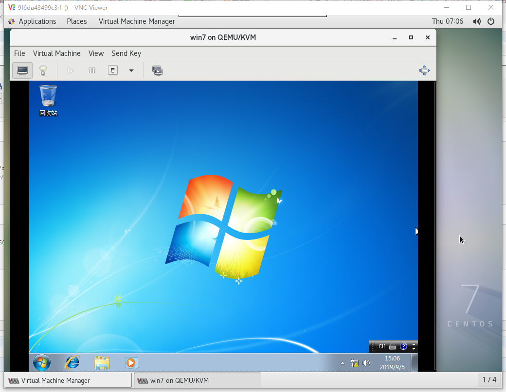

# 在Centos7上使用qemu安装虚拟机 #

**1.确定系统centos7**

```
cat /etc/redhat-release
CentOS Linux release 7.6.1810 (Core)
uname -r
4.4.190-1.el6.elrepo.x86_64
```

**2.安装kvm所需的各种依赖包**

```
yum -y install qemu-kvm kvm
yum -y install virt-manager python-virtinst qemu-kvm-tools      # 安装KVM的管理工具
yum -y install libvirt libvirt-python libguestfs-tools bridge-utils virt-viewer virt-2v

systemctl start libvirtd
systemctl enable libvirtd
```

**3.确定创建镜像的保存位置,创建镜像文件　**

```
cd /data/zkdocker/vm
1.硬盘固定创建方法
qemu-img create -f raw /opt/kvm.raw 10G
2.硬盘动态扩容(生产环境采用)
qemu-img create -f qcow2 vdisk.img 500G
3.查看信息
qemu-img info vdisk.img
```

**4.配置Virtual Machine Manager**

```
1.进入桌面打开Virtual Machine Manager
2.点击QEMU/KVM
3.Storage --> 左下角的加号 --> Add a New Storage Pool --> 配置好路径/data/zkdocker/vm
4.拷贝cn_windows_7_ultimate_x64_dvd_x15-66043.iso 到/data/zkdocker/vm中
5.点击Network Interfaces
6.创建br1
```

**5.创建虚拟机**

```
1.点击File --> New Virtual Machine
2.Use ISO image 选择配置好的镜像cn_windows_7_ultimate_x64_dvd_x15-66043.iso
3.Select or Create custom storage 选择配置好的vdisk.img
4.Network selection 选择配置好的br1
```

**6.虚拟机启动，安装镜像系统win7**

效果图如下： 　　

