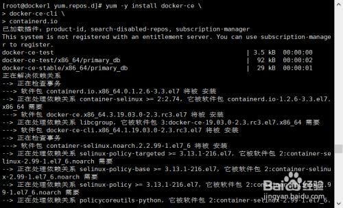

# Centos7安装docker #

这里Centos7利用Yum安装最新版的docker社区版，Centos7 extra源里有docker软件是旧版，这里安装docker新版本

 

方法/步骤
1、确保服务器连网，配置网络Yum源，安装docker需要extra源

    # cd /etc/yum.repos.d/

将阿里云的Centos-7.repo下载保存到该目录

	wget http://mirrors.aliyun.com/repo/Centos-7.repo

    # sed -i 's/$releasever/7/g' Centos-7.repo

2、安装Docker依赖

    # yum install -y yum-utils device-mapper-persistent-data lvm2

3、配置Docker的Yum源

    # yum-config-manager  --add-repo   https://download.docker.com/linux/centos/docker-ce.repo
    
    # yum-config-manager --enable docker-ce-nightly
    
    # yum-config-manager --enable docker-ce-test
    
    # yum-config-manager --disable docker-ce-nightly

4、安装Docker CE

    # yum -y install docker-ce docker-ce-cli containerd.io

5、启动Docker

 

    # systemctl start docker

查看docker安装版本信息

    # docker info

 

END