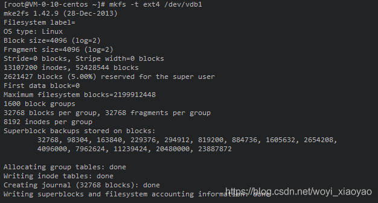

# Centos7挂载硬盘

一、查看新硬盘

	fdisk -l

可以看见新硬盘为/dev/vdb

二、硬盘分区

2.1、进入fdisk模式

	[root@VM-0-10-centos ~]# fdisk /dev/vdb

2.2、输入n进行分区

2.3、选择分区类型

这里有两个选项：

p:主分区linux上分区数最多能有4个

e:扩展分区linux上扩展分区只能有1个，扩展分区创建后不能直接使用，需要在扩展分区上创建逻辑分区。此处我选择p

2.4、选择分区数

可以选择4个分区，这里我只分成1个区

2.5、设置柱面，此处选择默认值即可

2.6、输入w，写入分区表，进行分区

三、格式化分区

将新分区格式化为ext4文件系统 

	mkfs -t ext4 /dev/vdb

四、挂载硬盘

4.1、将新硬盘挂载到home目录

	mount /dev/vdb /home

4.2、设置开机启动自动挂载

	#vi /etc/fstab 

在最后一行输入

	/dev/vdb                                 /home                   ext4    defaults        0 0

五、验证结果，输入指令：

	df -lh

————————————————

版权声明：本文为CSDN博主「佛系逍遥」的原创文章，遵循CC 4.0 BY-SA版权协议，转载请附上原文出处链接及本声明。

原文链接：https://blog.csdn.net/woyi_xiaoyao/article/details/109839683