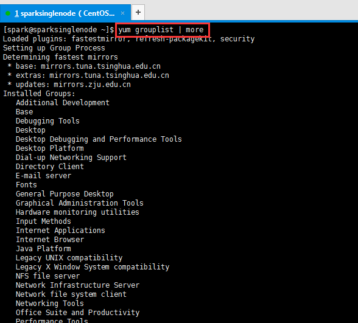
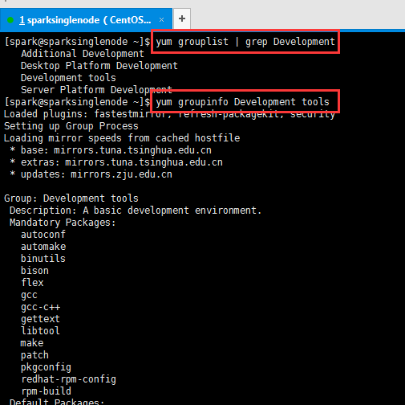

# Linux之一次性安装开发工具： #

    yum groupinstall Development tools



```
[spark@sparksinglenode ~]$ yum grouplist | more
Loaded plugins: fastestmirror, refresh-packagekit, security
Setting up Group Process
Determining fastest mirrors
* base: mirrors.tuna.tsinghua.edu.cn
* extras: mirrors.tuna.tsinghua.edu.cn
* updates: mirrors.zju.edu.cn
Installed Groups:
Additional Development
Base
Debugging Tools
Desktop
Desktop Debugging and Performance Tools
Desktop Platform
Dial-up Networking Support
Directory Client
E-mail server
Fonts
General Purpose Desktop
Graphical Administration Tools
Hardware monitoring utilities
Input Methods
Internet Applications
Internet Browser
Java Platform
Legacy UNIX compatibility
Legacy X Window System compatibility
NFS file server
Network Infrastructure Server
Network file system client
Networking Tools
Office Suite and Productivity
Performance Tools

Perl Support
Print Server
Printing client
SNMP Support
Security Tools
Server Platform
Web Server
X Window System
Installed Language Groups:
Arabic Support [ar]
Armenian Support [hy]
Assamese Support [as]
Bengali Support [bn]
Bhutanese Support [dz]
Chinese Support [zh]
Ethiopic Support [am]
Georgian Support [ka]
Gujarati Support [gu]
Hebrew Support [he]
Hindi Support [hi]
Inuktitut Support [iu]
Japanese Support [ja]
Kannada Support [kn]
Khmer Support [km]
Konkani Support [kok]
Korean Support [ko]
Kurdish Support [ku]
Lao Support [lo]
Maithili Support [mai]
Malayalam Support [ml]
Marathi Support [mr]

Myanmar (Burmese) Support [my]
Oriya Support [or]
Punjabi Support [pa]
Sinhala Support [si]
Tajik Support [tg]
Tamil Support [ta]
Telugu Support [te]
Thai Support [th]
Urdu Support [ur]
Venda Support [ve]
Available Groups:
Backup Client
Backup Server
CIFS file server
Client management tools
Compatibility libraries
Console internet tools
Desktop Platform Development
Development tools
Directory Server
Eclipse
Emacs
FCoE Storage Client
FTP server
Graphics Creation Tools
Guest Agents
High Availability
High Availability Management
Identity Management Server
Infiniband Support
KDE Desktop
Large Systems Performance

Load Balancer
Mainframe Access
Messaging Client Support
MySQL Database client
MySQL Database server
Network Storage Server
PHP Support
PostgreSQL Database client
PostgreSQL Database server
Remote Desktop Clients
Resilient Storage
Ruby Support
Scalable Filesystems
Scientific support
Server Platform Development
Smart card support
Storage Availability Tools
System Management
System administration tools
TeX support
Technical Writing
TurboGears application framework
Virtualization
Virtualization Client
Virtualization Platform
Virtualization Tools

Web Servlet Engine
Web-Based Enterprise Management
iSCSI Storage Client
Available Language Groups:
Afrikaans Support [af]
Albanian Support [sq]
Amazigh Support [ber]
Azerbaijani Support [az]
Basque Support [eu]
Belarusian Support [be]
Brazilian Portuguese Support [pt_BR]
Breton Support [br]
Bulgarian Support [bg]
Catalan Support [ca]
Chhattisgarhi Support [hne]
Chichewa Support [ny]
Coptic Support [cop]
Croatian Support [hr]
Czech Support [cs]
Danish Support [da]
Dutch Support [nl]
English (UK) Support [en_GB]
Esperanto Support [eo]
Estonian Support [et]
Faroese Support [fo]
Fijian Support [fj]
Filipino Support [fil]
Finnish Support [fi]
French Support [fr]
Frisian Support [fy]

Friulian Support [fur]
Gaelic Support [gd]
Galician Support [gl]
German Support [de]
Greek Support [el]
Hiligaynon Support [hil]
Hungarian Support [hu]
Icelandic Support [is]
Indonesian Support [id]
Interlingua Support [ia]
Irish Support [ga]
Italian Support [it]
Kashmiri Support [ks]
Kashubian Support [csb]
Kazakh Support [kk]
Kinyarwanda Support [rw]
Latin Support [la]
Latvian Support [lv]
Lithuanian Support [lt]
Low Saxon Support [nds]
Luxembourgish Support [lb]
Macedonian Support [mk]
Malagasy Support [mg]
Malay Support [ms]
Maltese Support [mt]
Manx Support [gv]
Maori Support [mi]
Mongolian Support [mn]
Nepali Support [ne]
Northern Sotho Support [nso]
Norwegian Support [nb]

Occitan Support [oc]
Persian Support [fa]
Polish Support [pl]
Portuguese Support [pt]
Romanian Support [ro]
Russian Support [ru]
Sanskrit Support [sa]
Sardinian Support [sc]
Serbian Support [sr]
Sindhi Support [sd]
Slovak Support [sk]
Slovenian Support [sl]
Somali Support [so]
Southern Ndebele Support [nr]
Southern Sotho Support [st]
Spanish Support [es]
Swahili Support [sw]
Swati Support [ss]
Swedish Support [sv]
Tagalog Support [tl]
Tetum Support [tet]
Tibetan Support [bo]
Tsonga Support [ts]
Tswana Support [tn]
Turkish Support [tr]
Turkmen Support [tk]
Ukrainian Support [uk]
Upper Sorbian Support [hsb]
Uzbek Support [uz]
Vietnamese Support [vi]
Walloon Support [wa]

Welsh Support [cy]
Xhosa Support [xh]
Zulu Support [zu]
Done
```
 



 

查看Grouplist

```
[spark@sparksinglenode ~]$ yum grouplist | grep Development
Additional Development
Desktop Platform Development
Development tools
Server Platform Development
[spark@sparksinglenode ~]$ yum groupinfo Development tools
Loaded plugins: fastestmirror, refresh-packagekit, security
Setting up Group Process
Loading mirror speeds from cached hostfile
* base: mirrors.tuna.tsinghua.edu.cn
* extras: mirrors.tuna.tsinghua.edu.cn
* updates: mirrors.zju.edu.cn

Group: Development tools
Description: A basic development environment.
Mandatory Packages:
autoconf
automake
binutils
bison
flex
gcc
gcc-c++
gettext
libtool
make
patch
pkgconfig
redhat-rpm-config
rpm-build
Default Packages:
byacc
cscope

ctags
cvs
diffstat
doxygen
elfutils
gcc-gfortran
git
indent
intltool
patchutils
rcs
subversion
swig
systemtap
Optional Packages:
ElectricFence
PyYAML
ant
babel
bzr
chrpath
cmake
compat-gcc-34
compat-gcc-34-c++
compat-gcc-34-g77
cvs-inetd
dejagnu
expect
gcc-gnat
gcc-java

gcc-objc
gcc-objc++
imake
jpackage-utils
kdewebdev
ksc
libstdc++-docs
mercurial
mod_dav_svn
nasm
perltidy
python-docs
python-requests
python-six
rpmdevtools
rpmlint
systemtap-sdt-devel
systemtap-server
Warning: Group tools does not exist.
```
 

 

 　　说了这么一番，就是，直接把这个组下，常用软件，一次性装好！

　　切换到root用户，

    yum -y groupinstall Development tools

   或者  

    yum groupinstall Development tools


    [root@sparksinglenode ~]# yum  groupinstall Development tools