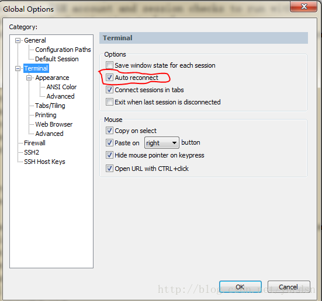

# SecureCRT使用SSH连接linux超时后自动断开 #

在开发的时候，用SecureCRT连接到linux服务器，老超时断开，影响工作了，所以像彻底解决这个问题！

研究了下，发现是因为客户端与服务器之间存在路由器，防火墙以及为了本身的安全性，在超过特定的时间后就会把空闲连接断开。或者是服务器端设置了断开空闲连接。

**解决方法：**

既然会断开超时的空闲连接，那么我们就应该让客户端与服务器之间的隔一段时间保持会话，方法有两个:
从服务器方面入手：

    vi /etc/ssh/sshd_config

修改配置文件 

    ClientAliveInterval 120（默认为0并且需要打开注释）

这个参数的是意思是每2分钟，服务器向客户端发一个消息，用于保持连接
然后把`TCPKeepAlive yes`注释去掉，重新启动服务

    service sshd reload

从客户端入手：
上面是配置需要服务器权限，如果没有服务器权限则可以使用这个方法，其思想是：客户端向服务器发一个消息，用于保持连接

secureCRT在Options->Global Options

————————————————

版权声明：本文为CSDN博主「滚动的薯条」的原创文章，遵循CC 4.0 BY-SA版权协议，转载请附上原文出处链接及本声明。

原文链接：https://blog.csdn.net/yucdsn/article/details/78458673