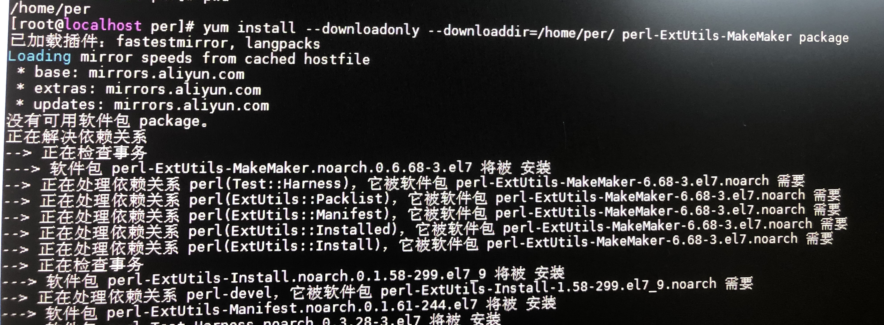

linux安装软件常常需要依赖包，如果可以连接互联网，那么非常方便，配置完成国内的yum源，比如阿里云，利用yum install完美完成。

但是有些企业办公电脑不能接入互联网，此时需要在能上网的电脑上下载好rpm依赖包，然后导入到办公网电脑上进行安装。图1

这个比较讨厌。

常用的下载rpm包方法是利用yum-plugin-downloadonly插件完成，把所有的依赖下载到指定目录。图2

命令是：（yum一般默认支持，可以不用安装）

    yum install yum-pluging-downloadonly

软后再下载相关的rpm包到指定目录。图3

命令是：

    yum install --downloadonly --downloaddir=/home/per perl-ExtUtils-MakeMaker package

这样就下载了perl-ExtUtils-MakeMaker package的依赖包，并且放置到/home/per目录下。图4

把这些rpm包copy到不能连接互联网的电脑上安装即可。

这是最简洁，最有效率的下载rpm包的方法。

有的同学不知道这种方法，下载一个包，发现还需要另外一个依赖，再下载，非常浪费时间和精力，有的时候就搞疯了，一天啥事情都不能完成，仅仅下载安装包。

