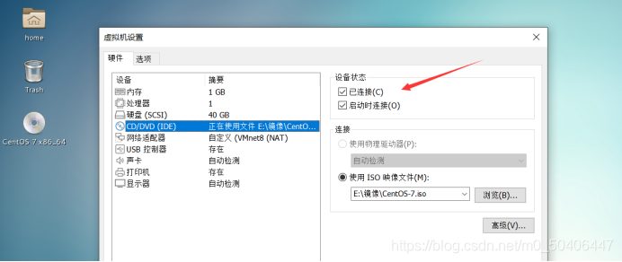
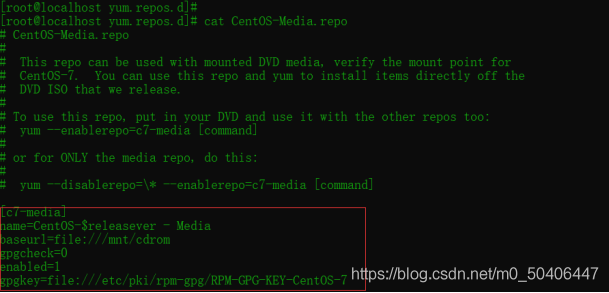
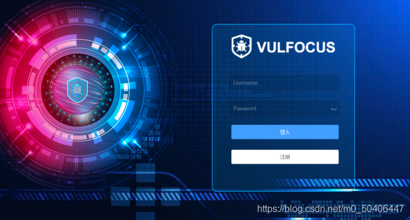
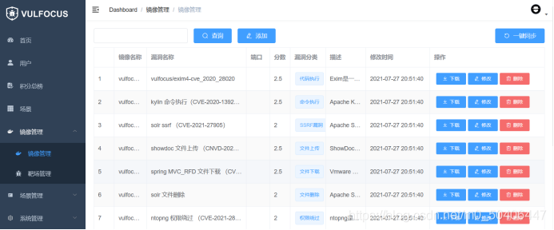

# vulfocus靶场搭建（实测） #

## vulfocus的特性 ##

1. 启动：一键漏洞环境启动，方便简单。
1. 自带 Flag 功能：每次启动 flag 都会自动更新，明确漏洞是否利用成功。
1. 带有计分功能也可适用于相关安全人员能力的考核。
1. 兼容 Vulhub、Vulapps 中所有漏洞镜像。

## 一、使用centos7作为靶机环境 ##

1.挂载镜像

	mkdir /mnt/cdrom:创建挂载点
	mount /dev/cdrom /mnt/cdrom:镜像挂载
	注意：这个必须已连接，否则镜像挂载失败

2.配置yum源

	(1)进入yum配置文件目录 cd /etc/yum.repos.d/
	(2)修改配置文件vim CentOS-Media.repo

## 二、docker安装 ##

1.使用官方安装脚本自动安装

	安装命令如下：
		 c0url -fsSL https://get.docker.com | bash -s docker --mirror aliyun
	也可以使用国内daocloud一键安装命令：
		curl -sSL https://get.daocloud.io/docker | sh

2.安装完成之后启动docker

	systemctl start docker

3.卸载docker 

	删除安装包：
		yum remove docker-ce
	删除镜像、容器、配置文件等内容：
		rm -rf /var/lib/docker

## 三、部署vulfocus环境 ##

1.拉取vulfocus镜像

	docker pull vulfocus/vulfocus:latest
	注意：这里镜像拉取不上重新启动一下docker环境

2.运行vulfocus

	docker create -p 80:80 -v /var/run/docker.sock:/var/run/docker.sock  -e VUL_IP=xxx.xxx.xxx.xxx vulfocus/vulfocus
	注意：此处有坑(-p 前边的端口代表物理机的端口，后边的端口是docker的端口)
	-v /var/run/docker.sock:/var/run/docker.sock 为 docker 交互连接。
	-e DOCKER_URL 为 Docker 连接方式，默认通过 unix://var/run/docker.sock 进行连接，也可以通过 tcp://xxx.xxx.xxx.xxx:2375 进行连接（必须开放 2375 端口）。
	-v /vulfocus-api/db.sqlite3:db.sqlite3 映射数据库为本地文件。
	-e VUL_IP=xxx.xxx.xxx.xxx 为 Docker 服务器 IP ，不能为 127.0.0.1。

3.在宿主机浏览器测试：输入docker服务器地址（centos7）
  在centos测试：URL输入回环地址或服务器地址都可以

4.默认账户密码为 admin/admin。

5.登录之后就可以在镜像管理中下载自己需要使用的镜像文件了（如果其中没有镜像，可以多刷新刷新）

————————————————

版权声明：本文为CSDN博主「南风-未起」的原创文章，遵循CC 4.0 BY-SA版权协议，转载请附上原文出处链接及本声明。

原文链接：https://blog.csdn.net/m0_50406447/article/details/119169686