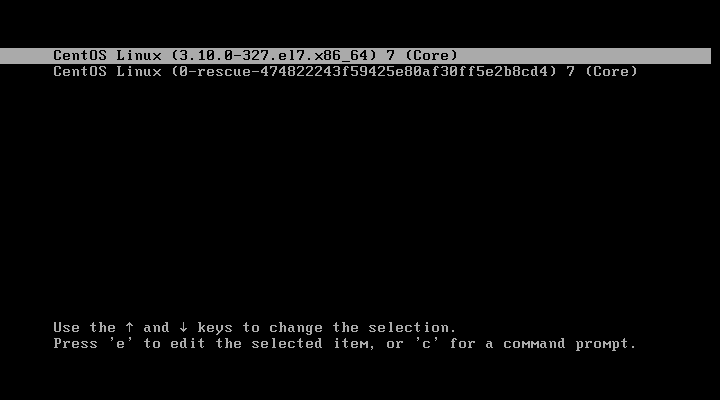
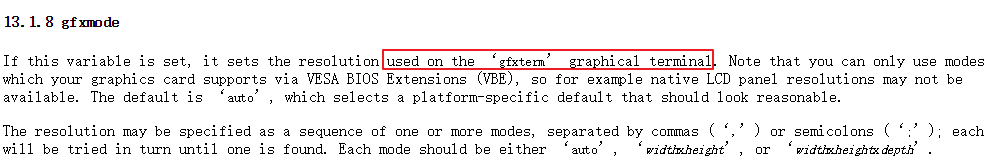
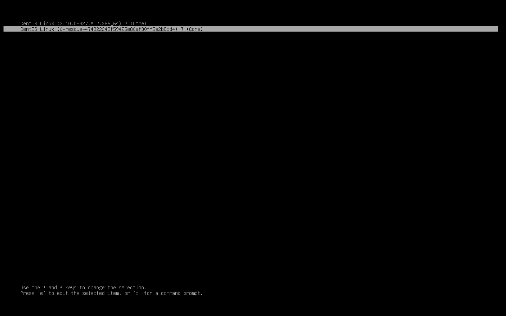

# CentOS7 设置GRUB2引导界面分辨率


原文链接：[https://www.cnblogs.com/nidey/p/6374860.html](https://www.cnblogs.com/nidey/p/6374860.html)

最近在学习OS引导启动，GRUB2的学习材料也不少，主要还看官方手册清晰些。

公司里办公机的多启动用的ubuntu的界面，还挺炫酷的。之前看其他博客网文里看到可以设置grub2的分辨率，我拿CentOS7.2试了下，发现不行。

网上都是说设置GRUB_GFXMODE=1440x900，再update-grub更新下grub.cfg，但是没生效（我又拿ubuntu14.04 server 试了，可以的）

后来还是看GRUB官方手册解决了。

### 正确解决方法

刚装的CentOS7.2 1511系统，正常启动，一般都是这样的，分辨率640x480




进入系统后，更改分辨率，设置如下

```
[root@min-base ~]# vim /etc/default/grub
```

将GRUB_TERMINAL_OUTPUT值由默认的"console"改为"gfxterm"，并添加GRUB_GFXMODE

```
GRUB_TIMEOUT=2
GRUB_DISTRIBUTOR="$(sed 's, release .*$,,g' /etc/system-release)"
GRUB_DEFAULT=saved
GRUB_DISABLE_SUBMENU=true
GRUB_TERMINAL_OUTPUT="gfxterm"
GRUB_CMDLINE_LINUX="crashkernel=auto rd.lvm.lv=centos/root rd.lvm.lv=centos/swap rhgb quiet"
GRUB_DISABLE_RECOVERY="true"
GRUB_GFXMODE=1440x900,1024x768,640x480
```
 

这里官方手册写得很清楚，ubuntu自带grub2默认是gfxterm, 而centos默认是console，所以只设置GRUB_GFXMODE不生效！



更新grub.cfg

```
[root@min-base ~]# grub2-mkconfig -o /boot/grub2/grub.cfg 
Generating grub configuration file ...
Found linux image: /boot/vmlinuz-3.10.0-327.el7.x86_64
Found initrd image: /boot/initramfs-3.10.0-327.el7.x86_64.img
Found linux image: /boot/vmlinuz-0-rescue-474822243f59425e80af30ff5e2b8cd4
Found initrd image: /boot/initramfs-0-rescue-474822243f59425e80af30ff5e2b8cd4.img
done
[root@min-base ~]#
```

新版grub2已经不再使用update-grub这个命令了，改用grub2-mkconfig


### 重启看下效果



效果不错，很细腻~

UEFI、BIOS、MBR、GPT等引导启动知识正在学习整理，后续补上。


